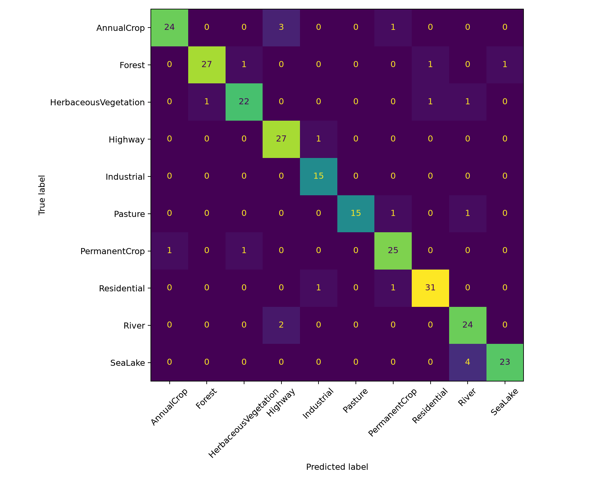
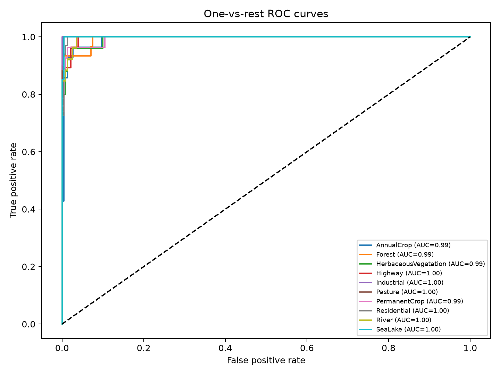

# Satellite Land-Use Classifier

A computer-vision system for classifying Sentinel-2 satellite image tiles into land-use categories and detecting temporal change between two observations. It uses transfer learning with ResNet-18, penultimate-layer embeddings, cosine similarity, and a Streamlit dashboard.

## Project capabilities

- **Land-use classification:** ImageNet-pretrained ResNet-18 classifies the 10 EuroSAT classes.
- **Transfer learning:** the ResNet backbone is retained and the classification head is fine-tuned.
- **Temporal change detection:** the model compares normalized feature embeddings with cosine similarity.
- **Change heatmap:** images are split into patches; high embedding difference is displayed as a heatmap.
- **Evaluation:** macro F1, per-class precision/recall/F1, confusion matrix, and one-vs-rest ROC curves.
- **Interactive dashboard:** upload one image to classify it, or two aligned images to inspect temporal change.

## Dataset and classes

The project uses [EuroSAT](https://github.com/phelber/EuroSAT), a Sentinel-2 land-use dataset with 27,000 RGB image tiles across these classes:

`AnnualCrop`, `Forest`, `HerbaceousVegetation`, `Highway`, `Industrial`, `Pasture`, `PermanentCrop`, `Residential`, `River`, and `SeaLake`.

The dataset and checkpoints are deliberately excluded from Git because of their size. The repository contains scripts to regenerate them.

## Requirements

- Python 3.10 or newer
- Windows PowerShell commands below; equivalent macOS/Linux virtual-environment commands also work
- Optional: NVIDIA GPU with CUDA for faster training. CPU inference and dashboard usage are supported.

## Installation

```powershell
git clone https://github.com/mayurugale75/imageclassifier.git
cd imageclassifier
python -m venv .venv
.\.venv\Scripts\Activate.ps1
python -m pip install --upgrade pip
pip install -r requirements.txt
```

If PowerShell blocks activation, run this once in the same terminal and then activate again:

```powershell
Set-ExecutionPolicy -Scope Process -ExecutionPolicy Bypass
```

## Download the dataset

```powershell
python download_dataset.py
```

This downloads EuroSAT to `dataset/`. If it is already present, do not download it again.

## Train a reproducible model

```powershell
python train.py --epochs 10
```

The script uses a fixed seed (`42`) and an 80/20 split. The best checkpoint is saved to:

```text
checkpoints/best_model.pt
```

Useful training options:

```powershell
python train.py --epochs 20 --batch-size 32 --lr 0.001 --seed 42
```

Training can take a long time on CPU. Use a CUDA-enabled machine where available.

## Evaluate the model

Run a full evaluation after training:

```powershell
python evaluate.py --checkpoint checkpoints/best_model.pt
```

The following files are generated in `artifacts/`:

```text
metrics.txt              macro F1 and per-class classification report
confusion_matrix.png     predicted versus actual class matrix
roc_curves.png           one-vs-rest ROC curves
```

For a quick smoke-test evaluation, add `--max-samples`:

```powershell
python evaluate.py --checkpoint checkpoints/best_model.pt --max-samples 256
```

Omit `--max-samples` for the final full-validation result.

## Run the dashboard

```powershell
streamlit run streamlit_app.py
```

Open the local address Streamlit prints (normally `http://localhost:8501`).

### Classification tab

1. Upload a `.png`, `.jpg`, or `.jpeg` satellite image.
2. The app shows the top predicted land-use category and the three highest class probabilities.

### Temporal change-detection tab

1. Upload an **Earlier image** and a **Later image** of the same location.
2. Use aligned images with similar scale and illumination for meaningful results.
3. Read the global cosine similarity: lower similarity means greater detected change.
4. Review the heatmap: brighter areas represent patches with greater embedding change.
5. Adjust the similarity alert threshold to suit the use case.

> A fresh clone has no model checkpoint. Train a model first, then use `checkpoints/best_model.pt` in the dashboard sidebar. This local workspace also supports its older `best_model.pt` checkpoint for demonstration.

## Project structure

```text
models/
  resnet.py              ResNet-18 classifier, embedding encoder, legacy-checkpoint loader
utils/
  data.py                reproducible EuroSAT data loading and transforms
  temporal.py            cosine similarity and patch-level heatmap logic
train.py                 training entry point
evaluate.py              metrics, confusion matrix, and ROC generation
streamlit_app.py         interactive Streamlit application
docs/results/            committed baseline metrics and evaluation figures
requirements.txt         Python dependencies
```

## Baseline results

The existing legacy ResNet-18 checkpoint was evaluated on a fixed 256-image slice of the reproducible validation partition.

| Metric | Result |
| --- | ---: |
| Accuracy | 0.91 |
| Macro F1 | 0.9117 |
| Evaluation images | 256 |

This is a demonstration benchmark, not the final full-partition result, because the original checkpoint was trained before the split seed was recorded. Retrain with `train.py` and run `evaluate.py` without `--max-samples` for the final reproducible score.





- [Metrics report](docs/results/metrics.txt)

## Validation performed

- Model inference was tested on a local EuroSAT tile: `AnnualCrop` was predicted as `AnnualCrop`.
- Embedding-based temporal comparison was tested and returned a full-size heatmap.
- The Streamlit dashboard was started headlessly and returned HTTP 200.
- Evaluation successfully produced the metrics report, confusion matrix, and ROC plots.

## Limitations and future work

- The temporal module detects visual/semantic embedding change; it does not predict a labelled change type.
- Reliable temporal results require co-registered images of the same location and comparable imaging conditions.
- The current change threshold is user controlled; it should be calibrated using labelled before/after image pairs for production use.
- A future version can add EfficientNet-B0, geospatial coordinates, true paired temporal data, and a validated change/no-change classifier.
